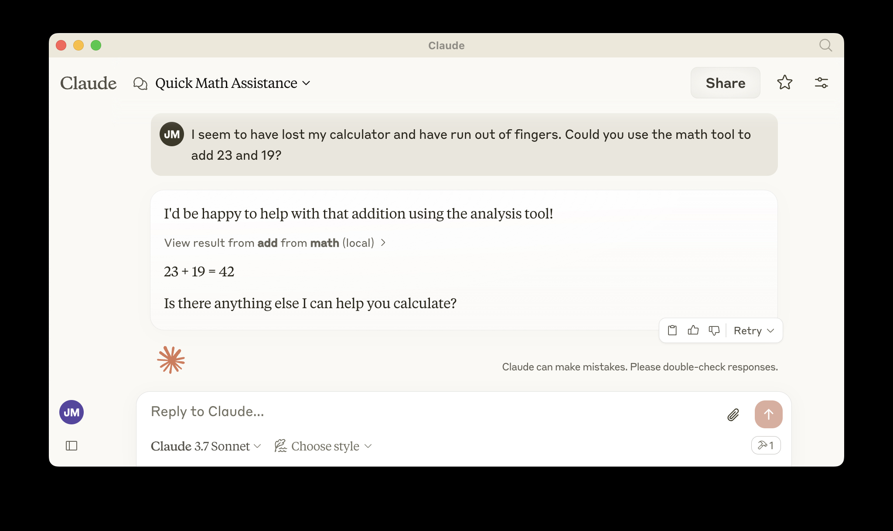

# Security Article Search MCP Server on Cloudflare

A remote MCP server that provides access to 4000+ security articles with advanced search capabilities, deployed on Cloudflare Workers with Containers for high-performance search.

## Features

- 🔍 **Full-Text Search**: Search across all article content, not just structured fields
- 📊 **Advanced Filtering**: Query 4000+ security articles across 40+ fields
- 🚀 **Container-based**: 4GB memory containers for fast search performance
- ☁️ **Cloudflare R2 Storage**: Efficient storage for large metadata
- 💰 **Cost-effective**: Runs on Workers Paid plan ($5/month)
- 🛡️ **Secure**: Direct R2 access via Worker bindings

## Available Tools

1. **`get_workflow_instructions`** - START HERE! Learn the correct workflow for searching
2. **`show_searchable_fields`** - Discover all 40+ searchable fields and categories
3. **`get_field_values`** - Get exact values for any field (required for accurate filtering)
4. **`query_articles`** - Search articles using structured field filters
5. **`search_full_text`** - Search across ALL article text (titles, summaries, full content)
6. **`get_article_details`** - Get complete article information by ID
7. **`show_field_values`** - Alias for get_field_values (compatibility)

## Prerequisites

1. **Docker Desktop** - [Download here](https://www.docker.com/products/docker-desktop/)
   - Must be running for deployment (check whale icon in menu bar)
   
2. **Cloudflare Workers Paid Plan** ($5/month)
   - Free plan does NOT support containers
   - Upgrade at: https://dash.cloudflare.com/?to=/:account/workers/plans
   
3. **Node.js 18+** and **Wrangler CLI**
   ```bash
   node --version       # Should show v18.0.0 or higher
   npm install -g wrangler
   wrangler --version   # Should show 3.0.0 or higher
   ```

### For Data Updates Only
- Python 3.x with conda environment
- AWS credentials (for S3 source data)
- R2 API credentials (see Data Refresh section)

## Setup & Installation

### Step 0: Pre-flight Check ✈️
```bash
# MUST pass ALL checks before proceeding:
docker --version        # Docker version 20.10.0 or higher
docker ps               # Should NOT error - Docker daemon must be running
node --version          # v18.0.0 or higher
npx wrangler --version  # 3.0.0 or higher
```

### Step 1: Clone and Install
```bash
git clone <your-repo-url>
cd remote-mcp-server
npm install
```

### Step 2: Authenticate with Cloudflare
```bash
npx wrangler login
# This opens a browser - click "Allow" to authenticate
```

### Step 3: Create R2 Bucket and Upload Data
```bash
# This creates the R2 bucket and uploads initial data
npm run setup

# Expected output:
# ✅ Creating R2 bucket 'security-article-search-data'...
# ✅ Uploading search_metadata.json...
# ✅ Setup complete!
```

### Step 4: Test Locally (Optional but Recommended)
```bash
npm run dev

# Expected output:
# ⛅️ wrangler 3.x.x
# Your worker has access to the following bindings:
# - R2 Bucket: SEARCH_DATA
# - Durable Object: MCP_CONTAINER
# [mf:inf] Ready on http://localhost:8787/
```

Open [`http://localhost:8787/`](http://localhost:8787/) in your browser - you should see a green "✅ Server Running" status.

## Connect the MCP inspector to your server

To explore your new MCP api, you can use the [MCP Inspector](https://modelcontextprotocol.io/docs/tools/inspector).

- Start it with `npx @modelcontextprotocol/inspector`
- [Within the inspector](http://localhost:5173), switch the Transport Type to `SSE` and enter `http://localhost:8787/sse` as the URL of the MCP server to connect to, and click "Connect"
- You will navigate to a (mock) user/password login screen. Input any email and pass to login.
- You should be redirected back to the MCP Inspector and you can now list and call any defined tools!

<div align="center">
  
</div>

<div align="center">
  
</div>

## Connect Claude Desktop to your local MCP server

The MCP inspector is great, but we really want to connect this to Claude! Follow [Anthropic's Quickstart](https://modelcontextprotocol.io/quickstart/user) and within Claude Desktop go to Settings > Developer > Edit Config to find your configuration file.

Open the file in your text editor and replace it with this configuration:

```json
{
  "mcpServers": {
    "security-search": {
      "command": "npx",
      "args": [
        "mcp-remote",
        "http://localhost:8787/sse"
      ]
    }
  }
}
```

This will run a local proxy and let Claude talk to your MCP server over HTTP

When you open Claude a browser window should open and allow you to login. You should see the tools available in the bottom right. Given the right prompt Claude should ask to call the tool.

<div align="center">
  
</div>

<div align="center">
  
</div>

## Deploy to Cloudflare

### 🔴 STOP! Pre-deployment Checklist
**ALL items must be checked before deploying:**

```bash
# Run this checklist script:
echo "Checking deployment requirements..."

# 1. Docker running?
docker ps > /dev/null 2>&1 && echo "✅ Docker is running" || echo "❌ Docker NOT running - START IT NOW!"

# 2. Logged into Cloudflare?
npx wrangler whoami > /dev/null 2>&1 && echo "✅ Logged into Cloudflare" || echo "❌ Not logged in - Run: npx wrangler login"

# 3. On paid plan? (Manual check)
echo "⚠️  Manual check: Verify Workers Paid plan at https://dash.cloudflare.com/?to=/:account/workers/plans"

# 4. R2 bucket exists?
npx wrangler r2 bucket list 2>/dev/null | grep -q "security-article-search-data" && echo "✅ R2 bucket exists" || echo "❌ R2 bucket missing - Run: npm run setup"
```

### Deploy Command
```bash
# ONLY run this after ALL checks pass:
npm run deploy
```

### What Happens During Deployment

1. **Building Container** (~60 seconds)
   ```
   🔨 Building container image...
   [+] Building 45.2s (8/8) FINISHED
   ```

2. **Pushing to Registry** (~30 seconds)
   ```
   📤 Pushing to Cloudflare registry...
   The push refers to repository [registry.cloudflare.com/...]
   ```

3. **Deploying Worker** (~20 seconds)
   ```
   🚀 Deploying Worker with container support...
   Uploaded remote-mcp-server (X sec)
   Published remote-mcp-server (Y sec)
   ```

4. **Success Output**
   ```
   ✅ Deployment complete!
   🌍 Your MCP server is live at:
   https://remote-mcp-server.<your-account>.workers.dev
   ```

### ⏱️ Deployment Times
- **First deployment**: 2-3 minutes (builds and uploads Docker image)
- **Subsequent deployments**: 30-45 seconds (uses cached image)
- **Container cold start**: 10-30 seconds (after 10 min idle)

## Call your newly deployed remote MCP server from a remote MCP client

Just like you did above in "Develop locally", run the MCP inspector:

`npx @modelcontextprotocol/inspector@latest`

Then enter the `workers.dev` URL (ex: `worker-name.account-name.workers.dev/sse`) of your Worker in the inspector as the URL of the MCP server to connect to, and click "Connect".

You've now connected to your MCP server from a remote MCP client.

## Connect Claude Desktop to your remote MCP server

Update the Claude configuration file to point to your `workers.dev` URL and restart Claude.

**IMPORTANT**: Replace `your-account` with your actual Cloudflare account name

```json
{
  "mcpServers": {
    "security-search-remote": {
      "command": "npx",
      "args": [
        "mcp-remote",
        "https://remote-mcp-server.your-account.workers.dev/sse"
      ]
    }
  }
}
```

## Search Capabilities

### Structured Search (`query_articles`)
Search using exact field values:
```javascript
// Find critical AWS vulnerabilities from last month
{
  "filters": {
    "severity_level": ["Critical"],
    "cloud_platforms": ["AWS"]
  },
  "since_date": "2024-11-01",
  "limit": 20
}
```

### Full-Text Search (`search_full_text`)
Search across all article content when entities aren't in structured fields:
```javascript
// Find any mention of HSBC in articles
{
  "query": "HSBC",
  "since_date": "2024-10-01",
  "limit": 30
}

// Combine text search with filters
{
  "query": "ransomware",
  "filters": {
    "severity_level": ["Critical", "High"]
  }
}
```

### Why Two Search Methods?
- **Structured search** is precise but only finds exact matches in specific fields
- **Full-text search** finds ANY mention anywhere in articles (e.g., HSBC mentioned in breach articles but not listed as affected organization)
- Use both for comprehensive results

## Troubleshooting

### 🔴 Deployment Failures

#### "The Docker CLI could not be launched"
```bash
# CAUSE: Docker Desktop not running
# FIX:
1. Start Docker Desktop application
2. Wait for whale icon to appear in menu bar
3. Run: docker ps  # Should work without error
4. Retry deployment: npm run deploy
```

#### "workers.dev subdomain not available"
```bash
# CAUSE: Need to set up workers.dev subdomain
# FIX:
npx wrangler subdomain
# Enter a unique subdomain when prompted
```

#### "Unauthorized" or "Authentication error"
```bash
# CAUSE: Not logged into Cloudflare
# FIX:
npx wrangler logout
npx wrangler login
# Click "Allow" in browser
npm run deploy
```

#### "Resource limit exceeded" or "Containers not available"
```bash
# CAUSE: Not on Workers Paid plan
# FIX:
1. Go to: https://dash.cloudflare.com/?to=/:account/workers/plans
2. Upgrade to Workers Paid ($5/month)
3. Wait 2-3 minutes for plan to activate
4. Retry: npm run deploy
```

### 🟡 Runtime Issues

#### Container Sleeping (10+ min idle)
```bash
# SYMPTOM: First request times out after idle period
# BEHAVIOR: Container sleeps after 10 min, takes 10-30s to wake
# FIX: Just retry - second request will work
```

#### "Container is not responding"
```bash
# CAUSE: Container crashed or in bad state
# FIX:
1. Check logs: npx wrangler tail
2. Restart by redeploying: npm run deploy
```

#### Tools Hanging in Claude Desktop
```bash
# CAUSE: Usually container waking up from sleep
# FIX:
1. Wait 30 seconds
2. Try the tool again
3. If still hanging, check logs: npx wrangler tail
```

### 🟢 Debugging Commands

```bash
# View real-time logs
npx wrangler tail

# Test container health
curl https://remote-mcp-server.<your-account>.workers.dev/health

# Check R2 bucket
npx wrangler r2 bucket list
npx wrangler r2 object list security-article-search-data

# Test locally (bypass deployment issues)
npm run dev
# Then: curl http://localhost:8787/health
```

### 🔄 Nuclear Reset (Last Resort)

```bash
# Complete reset and redeploy
1. docker ps  # Ensure Docker is running
2. npx wrangler logout && npx wrangler login
3. npm run clean  # Clean build artifacts
4. npm install    # Reinstall dependencies  
5. npm run setup  # Recreate R2 bucket
6. npm run deploy # Fresh deployment
```

### 📊 Common Error Patterns

| Error | Cause | Fix |
|-------|-------|-----|
| "Docker CLI could not be launched" | Docker not running | Start Docker Desktop |
| "Unauthorized" | Not logged in | `npx wrangler login` |
| "Resource limit exceeded" | Free plan | Upgrade to paid plan |
| "Container is not responding" | Container sleeping | Retry after 30s |
| "Migration error" | Version conflict | Increment migration version |
| Tools timeout | Container cold start | Wait and retry |
