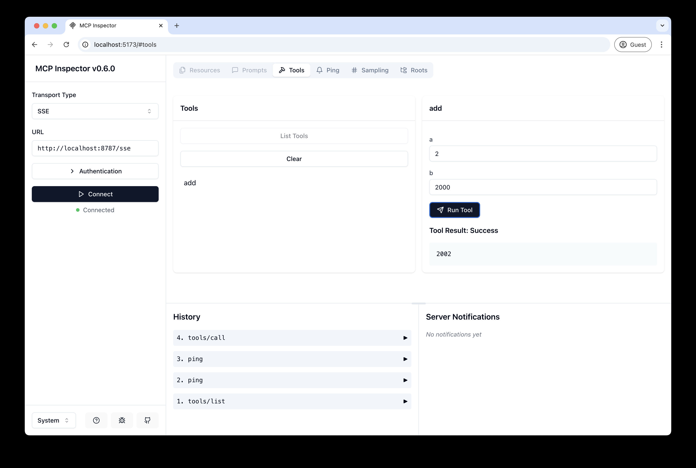

# Security Article Search MCP Server on Cloudflare

A remote MCP server that provides access to 4000+ security articles with advanced search capabilities, deployed on Cloudflare Workers with Containers for high-performance search.

## Features

- 🔍 **Advanced Search**: Query 4000+ security articles across 40+ fields
- 🚀 **Container-based**: 4GB memory containers for fast search performance
- ☁️ **Cloudflare R2 Storage**: Efficient storage for large metadata
- 💰 **Cost-effective**: Runs on Workers Paid plan ($5/month)
- 🛡️ **Secure**: Direct R2 access via Worker bindings

## Available Tools

1. **`get_workflow_instructions`** - START HERE! Learn the correct 3-step workflow
2. **`show_searchable_fields`** - Discover all searchable fields
3. **`get_field_values`** - Get exact field values for filtering
4. **`query_articles`** - Search articles with complex filters
5. **`get_article_details`** - Get full article information
6. **`show_field_values`** - Compatibility alias for field values

## Prerequisites

### Required
- ✅ **Docker Desktop** installed and **RUNNING** (containers won't deploy without it!)
- ✅ **Cloudflare Workers Paid Plan** ($5/month minimum for containers)
- ✅ **Node.js 18+** installed
- ✅ **Wrangler CLI** (`npm install -g wrangler`)

### For Data Updates
- Python 3.x with conda environment
- AWS credentials (for S3 source data)
- R2 API credentials (see Data Refresh section)

## Setup & Installation

```bash
# 1. Install dependencies
npm install

# 2. Login to Cloudflare
npx wrangler login

# 3. Upload metadata to R2 (creates bucket automatically)
npm run setup

# 4. Run locally for testing
npm run dev
```

You should be able to open [`http://localhost:8787/`](http://localhost:8787/) in your browser

## Connect the MCP inspector to your server

To explore your new MCP api, you can use the [MCP Inspector](https://modelcontextprotocol.io/docs/tools/inspector).

- Start it with `npx @modelcontextprotocol/inspector`
- [Within the inspector](http://localhost:5173), switch the Transport Type to `SSE` and enter `http://localhost:8787/sse` as the URL of the MCP server to connect to, and click "Connect"
- You will navigate to a (mock) user/password login screen. Input any email and pass to login.
- You should be redirected back to the MCP Inspector and you can now list and call any defined tools!

<div align="center">
  
</div>

<div align="center">
  
</div>

## Connect Claude Desktop to your local MCP server

The MCP inspector is great, but we really want to connect this to Claude! Follow [Anthropic's Quickstart](https://modelcontextprotocol.io/quickstart/user) and within Claude Desktop go to Settings > Developer > Edit Config to find your configuration file.

Open the file in your text editor and replace it with this configuration:

```json
{
  "mcpServers": {
    "security-search": {
      "command": "npx",
      "args": [
        "mcp-remote",
        "http://localhost:8787/sse"
      ]
    }
  }
}
```

This will run a local proxy and let Claude talk to your MCP server over HTTP

When you open Claude a browser window should open and allow you to login. You should see the tools available in the bottom right. Given the right prompt Claude should ask to call the tool.

<div align="center">
  
</div>

<div align="center">
  
</div>

## Deploy to Cloudflare

### Pre-deployment Checklist
- [ ] Docker Desktop is **running** (check the whale icon in your menu bar)
- [ ] You have Workers Paid plan active ($5/month)
- [ ] You're logged in: `npx wrangler login`
- [ ] R2 bucket has data: `npm run upload-data`

### Deploy Command (ONE command!)
```bash
npm run deploy
```

This will:
1. Build the Docker container image
2. Push it to Cloudflare's registry
3. Deploy the Worker with container support
4. Output your URL: `https://remote-mcp-server.<your-account>.workers.dev`

### First Deployment Note
The first deployment takes ~2-3 minutes as it builds and uploads the Docker image. Subsequent deployments are faster (~30 seconds).

## Call your newly deployed remote MCP server from a remote MCP client

Just like you did above in "Develop locally", run the MCP inspector:

`npx @modelcontextprotocol/inspector@latest`

Then enter the `workers.dev` URL (ex: `worker-name.account-name.workers.dev/sse`) of your Worker in the inspector as the URL of the MCP server to connect to, and click "Connect".

You've now connected to your MCP server from a remote MCP client.

## Connect Claude Desktop to your remote MCP server

Update the Claude configuration file to point to your `workers.dev` URL and restart Claude.

**IMPORTANT**: 
- Use `mcp-remote` (NOT `@cloudflare/mcp-server-cloudflare`)
- Replace `your-account` with your actual Cloudflare account name
- Remove any local Python MCP configs to avoid duplicate tools

```json
{
  "mcpServers": {
    "security-search-remote": {
      "command": "npx",
      "args": [
        "mcp-remote",
        "https://remote-mcp-server.your-account.workers.dev/sse"
      ]
    }
  }
}
```

## Troubleshooting

### Container won't deploy
**Error**: "The Docker CLI could not be launched"
- **Solution**: Start Docker Desktop first! The whale icon should be in your menu bar.

**Error**: "Container is not responding"
- **Cause**: Container is sleeping (happens after 10 min idle)
- **Solution**: Retry the request - container wakes up in 10-30 seconds

### Tools hanging/timeout
- **First request after idle**: Container needs 10-30 seconds to wake up
- **Solution**: Just retry - second request should work

### Migration errors
**Error**: "Cannot apply migration..."
- **Solution**: Already fixed in current setup, but if it happens:
  ```bash
  # Increment the migration version in wrangler.jsonc
  # Change v8 to v9, v10, etc.
  ```

### Check deployment status
```bash
# View logs
npx wrangler tail

# Test locally
npm run dev

# Check container status in dashboard
open https://dash.cloudflare.com
```

### Reset everything
If all else fails:
```bash
# 1. Make sure Docker is running
# 2. Clean deploy
npm run deploy
```
